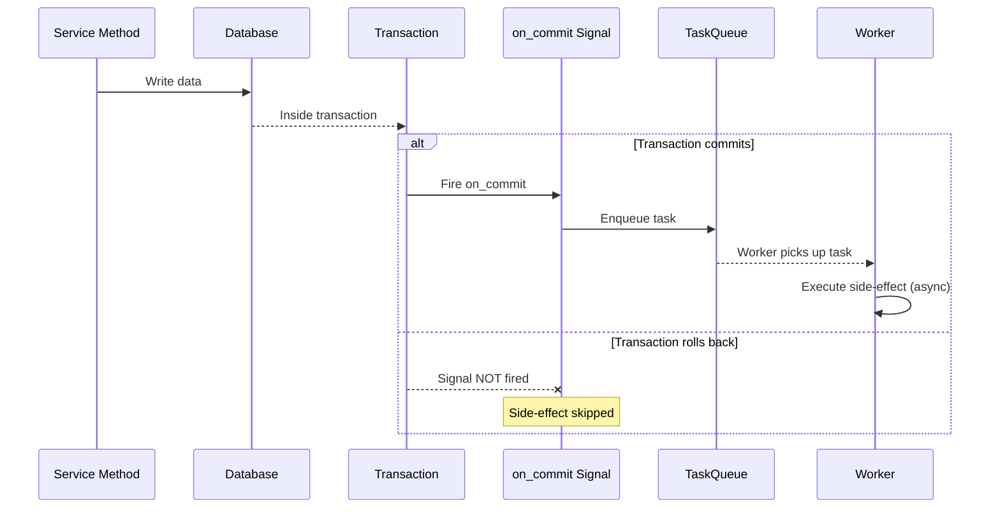

# Reliable Async Side-Effect Pattern

How to combine reinhardt signals with the task system for guaranteed post-commit side-effects.

---

## The Problem

Using `post_save` directly for side-effects is unreliable:

- The signal fires inside the transaction — if the transaction rolls back, the side-effect already ran
- Network failures in the receiver can break the main transaction
- Synchronous processing blocks the request

## The Solution: Transaction Signal + Task Queue



## Implementation

### Step 1: Define the Background Task

```rust
use reinhardt_tasks::{Task, TaskExecutor, TaskId, TaskPriority, TaskResult};
use serde::{Deserialize, Serialize};
use uuid::Uuid;

#[derive(Debug, Serialize, Deserialize)]
pub struct SendOrderConfirmation {
    task_id: TaskId,
    order_id: Uuid,
}

impl SendOrderConfirmation {
    pub fn new(order_id: Uuid) -> Self {
        Self {
            task_id: TaskId::new(),
            order_id,
        }
    }
}

impl Task for SendOrderConfirmation {
    fn id(&self) -> TaskId {
        self.task_id
    }

    fn name(&self) -> &str {
        "send_order_confirmation"
    }

    fn priority(&self) -> TaskPriority {
        TaskPriority::new(7) // High priority
    }
}

#[async_trait]
impl TaskExecutor for SendOrderConfirmation {
    async fn execute(&self) -> TaskResult<()> {
        // Idempotent: check if already sent before sending
        // Fetch order by ID, send email, mark as notified
        Ok(())
    }
}
```

### Step 2: Connect to on_commit Signal

```rust
use std::sync::Arc;

use reinhardt::core::{
    connect_receiver,
    signals::transaction::{self, TransactionContext},
};

pub fn register_order_signals() {
    connect_receiver!(
        transaction::on_commit(),
        |_ctx: Arc<TransactionContext>| async move {
            // This runs ONLY after the transaction commits
            // The task queue handles async processing
            Ok(())
        },
        dispatch_uid = "order_confirmation_on_commit"
    );
}
```

### Step 3: Enqueue an Ordinary Task after Commit

Use the transaction-aware receiver to schedule ordinary work after the domain
write commits. The current `TaskQueue` receives both the boxed task and its
configured backend:

```rust
use reinhardt::tasks::{TaskBackend, TaskExecutionError, TaskId, TaskQueue};

async fn enqueue_order_confirmation(
    queue: &TaskQueue,
    backend: &dyn TaskBackend,
    order_id: Uuid,
) -> Result<TaskId, TaskExecutionError> {
    queue
        .enqueue(Box::new(SendOrderConfirmation::new(order_id)), backend)
        .await
}
```

### Durable Job Variant (0.4.x)

Use a durable job when the side-effect must survive a process restart or a UI
must be able to query its state. Enable `tasks-durable` on the `reinhardt`
facade (and `di` when injecting the queue into server functions), then create
the SQLite-backed store once during application setup. Give it a SQLite URL;
do not pass an application's PostgreSQL, MySQL, or CockroachDB URL to
`SqliteDurableJobStore`.

```rust
use std::sync::Arc;

use reinhardt::tasks::{
    DurableJobStore, DurableQueue, DurableQueueError, JobSnapshot, JobSpec,
    SharedDurableQueue, SqliteDurableJobStore,
};
use serde::Serialize;
use uuid::Uuid;

#[derive(Serialize)]
struct SendOrderConfirmationPayload {
    order_id: Uuid,
}

async fn make_durable_queue(
    sqlite_database_url: &str,
) -> Result<SharedDurableQueue, DurableQueueError> {
    let store: Arc<dyn DurableJobStore> =
        Arc::new(SqliteDurableJobStore::new(sqlite_database_url).await?);
    Ok(DurableQueue::new(store))
}

async fn enqueue_durable_order_confirmation(
    queue: &SharedDurableQueue,
    order_id: Uuid,
) -> Result<JobSnapshot, DurableQueueError> {
    let job = JobSpec::new("send_order_confirmation")
        .target(order_id)
        .payload(&SendOrderConfirmationPayload { order_id })?;

    queue.enqueue(job).await
}
```

Invoke the enqueue function from an `on_commit` receiver or an equivalent
after-commit boundary. A durable enqueue persists its own job record; it does
not roll back automatically with an unrelated domain transaction.

Workers must complete the `JobClaim` from `claim_next` with `succeed`,
`fail_retryable`, `fail_final`, or `cancel`. Expose `JobSnapshot` and ordered
`events` for status endpoints. A running job's `request_cancel` is cooperative,
not an immediate terminal state. Workers that honor it call `cancel`; otherwise
the eventual success or failure completion determines the terminal state.

## Key Rules

1. **NEVER perform side-effects inside `post_save`** — the transaction may still roll back
2. **ALWAYS use `on_commit` or another explicit after-commit boundary** — guarantees the DB write is committed before work is enqueued
3. **Task execution MUST be idempotent** — at-least-once delivery means it may run multiple times
4. **Pass IDs, not objects** — tasks are serialized; model instances cannot be serialized
5. **No cascading** — a task MUST NOT enqueue another signal-triggered task chain
6. **Choose durable jobs deliberately** — use `DurableQueue` for restart-safe, observable work; do not add persistence to a simple fire-and-forget task without a product need

## Idempotency Patterns

```rust
// Pattern 1: Check-before-act
async fn execute(&self) -> TaskResult<()> {
    let order = self.repo.get(self.order_id).await?;
    if order.notification_sent {
        return Ok(()); // Already processed
    }
    self.send_email(&order).await?;
    self.repo.mark_notified(self.order_id).await?;
    Ok(())
}

// Pattern 2: Upsert with unique constraint
async fn execute(&self) -> TaskResult<()> {
    // INSERT ... ON CONFLICT DO NOTHING
    self.repo.upsert_notification(self.order_id).await?;
    Ok(())
}
```

## When NOT to Use This Pattern

| Scenario | Use Instead |
|----------|-------------|
| Simple validation before save | `pre_save` signal |
| Synchronous field computation | Model method or service logic |
| Real-time response needed | Direct service call (no async) |
| Fire-and-forget logging | `post_save` with error swallowing |
